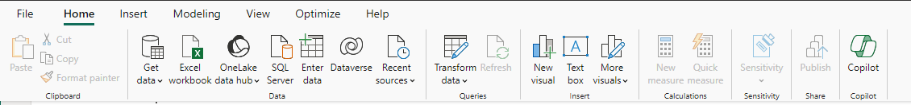
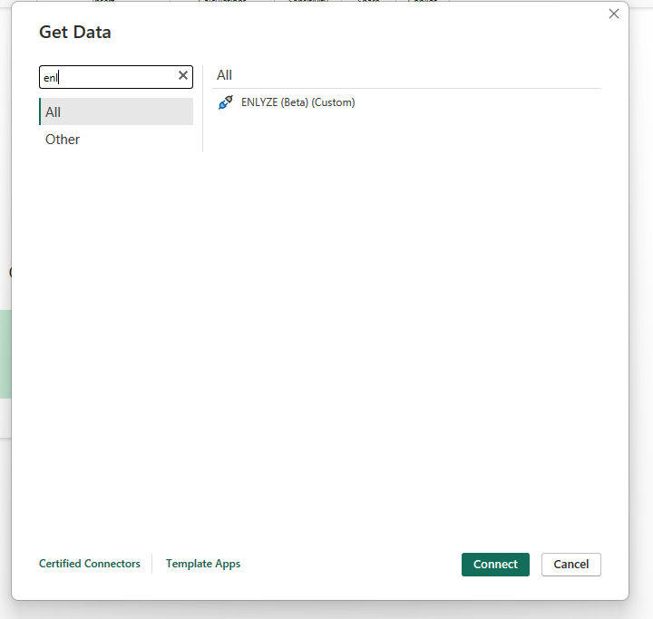
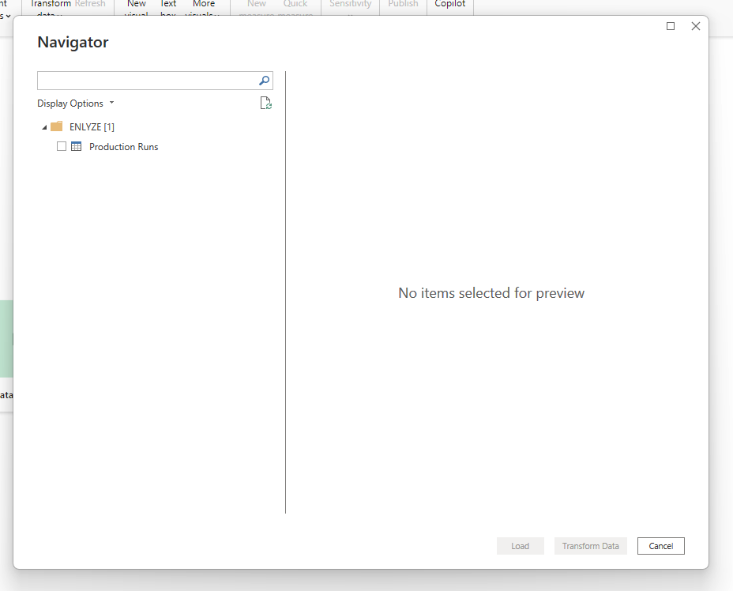

# ENLYZE Power BI Integration

The ENLYZE Power BI Custom Connector allows ENLYZE users to synchronize their production data with Power BI. The project is based on the [Power Query Connector Development SDK](https://github.com/microsoft/vscode-powerquery-sdk).

## Features

This is what you can do with the Power BI Integration:

- Fetch Production Runs

## Installation

At the moment, the Power BI Custom Connector is not listed in the official Power BI Custom Connector and needs to be installed manually. This is accomplished by the following steps:

- Allowing uncertified 3rd party connectors within Power BI
- Copying the ENLYZE Power BI Custom Connector to the Custom Connector directory

### Allowing uncertified 3rd party connectors within Power BI

Complete the following steps [described here](https://learn.microsoft.com/en-us/power-bi/connect-data/desktop-connector-extensibility#custom-connectors) as a user with administrator rights.

### Copying the ENLYZE Power BI Custom Connector to the Custom Connector directory

In order to register the ENLYZE Power BI Custom Connector with Power BI, download the `enlyze.mez` file from the latest relase and move it to `\Documents\Power Bi Desktop\Custom Connectors`. Create the path if it does not exist yet.

## Fetching data

With Power BI open, click on get data:

Then, search for enlyze:

Finally, select the dataset you want to query:

